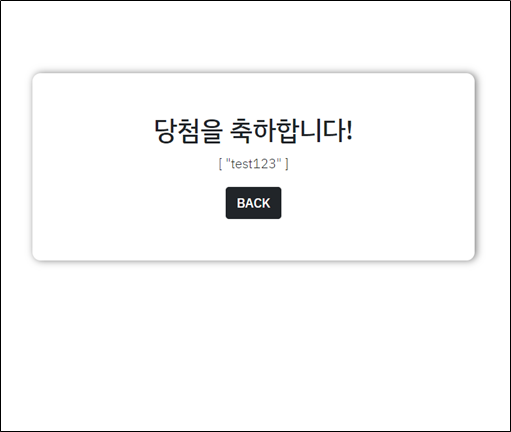

# CINEPOP

## 1. 개요

: 영화 추천 서비스 및 영화 관련 이벤트 사이트

추천 서비스는 4가지의 질문을 통해 사용자의 영화보는 조건을 파악 후 조건에 가장 부합하는 영화 10편을 제공합니다. 약 320가지의 조건에 대한 응답이 가능한 추천 서비스입니다. 

영화 관련 이벤트는 Popcorn 이벤트와 Review 이벤트로 나누어집니다. Popcorn 이벤트는 소정의 돈을 내고 참가하면 일정 확률로 팝콘을 얻을 수 있는 영화관 방문 유도 이벤트이며, Review이벤트의 경우 User의 활동내역을 포인트화, 그 후 다른 User들과의 랭킹화를 통해 Community 활성화를 유도하는 이벤트로 이루어져있습니다. 

기능별로 구현을 했고, 각 기능별로 독립성이 높기 때문에 기능별로 진행합니다. 순서는 Home 및 기본 Component, Movie 및 Community, Recommendation, Popcorn event, Review event로 진행합니다. 

### - 기술스택

back: Django Restframework

front: Vue, Vuex, Bootstrap

DB: SQLite

협업툴: Gitlab, Git, Notion, Diagram.io

### 활용한 작업도구

- Kanban Board

  : Kanban Board 활용을 통한 일정 관리 및 프로젝트 관리

- ERD 도표

  : ERD 도표를 작성해둠으로서 데이터 모델을 미리 설계 및 구상

## 2. Home 및 기본 Component

### 2-1 기본 Component 및 Navbar

Cinepop의 모든 페이지는 기본적으로 navbar를 가지고 있으며 해당 navbar를 통해 home, 영화 추천, 이벤트 참여, 로그인, 로그아웃, 계정 생성 페이지로 바로 이동할 수 있습니다. 

Navbar의 경우, 로그아웃 상태에서는 우측에 Log in, Sign up이 있으며 사이트에서 제공하는 기능들을 활용할 수 없습니다. 

로그인 상태에서는 우측에 유저 이름이 표시가 되며 클릭시 드롭다운 메뉴가 열리며 유저의 프로필 페이지에 따로 들어갈 수 있습니다.

(로그아웃 시 Navbar)

(로그인 시 Navbar)

### 2-2 Home

home은 처음에 이벤트와 영화 추천 페이지로 바로 갈 수 있는 이미지로 구성되어 있으며 하단에는 TMDB 제공의 인기 영화를 movie card component를 활용하여 나열해두었습니다. 그래서 home을 통해 movie detail page 혹은 특정 event 페이지로 이동이 가능합니다. 

(홈화면 및 Navbar)

### 2-3 Log In 및 Sign Up 

: 로그인 상태가 아닐 경우 Navbar 상단 우측을 통해서 Log in 화면으로 들어갈 수 있으며, 계정이 없는 경우 바로 sign up 화면으로 들어갈 수 있습니다. 

## 3. Movie 및 Community

Home 또는 Recommendation에서 노출된 movie 카드를 통해 Movie detail에 들어올 수 있습니다. 이때 특정 영화에 대한 활발한 토론을 이끌어내기 위해 Community는 하나의 공간이 아닌 각 Movie detail마다 생성이 되어 있으며 해당 Community에서 review의 작성, 수정 삭제, review에 대한 comment의 review 수정 삭제, review에 대한 좋아요, 좋아요 취소를 실행할 수 있습니다. 

## 4. Recommendation

본 페이지는 영화 추천 기능으로서 크게 RecommendationQuestion, RecommendationResult로 구성이 되어 있습니다. RecommendationQuestion의 기능은 User들의 영화를 보는 상황을 4가지 주제(같이 보는 사람, 기분, 나이대, 장소)를 localStorage에 응답을 저장해주는 역할을 합니다. 그 후 Question4에서 QuestionResult로 넘어가면 그 동안 받았던 응답을 Django 데이터 서버에 옮겨주면서 응답받은 조건에 맞게 가공한 후 인기도 순위가 높은 상위 10개의 영화를 QuestionResult 페이지에 응답을 전달해줍니다. 이러한 추천 방법은 약 320가지의 상황에 대한 추천을 해줄 수 있으며 해당 결과 화면에서 바로 movie detail 화면에 들어갈 수 있게 설계를 해두어 영화에 대한 사람들의 실제 평가도 확인할 수 있습니다. 

## 5. Event: Popcorn

\- 이벤트 설명: User가 2000원을 내고 참가를 하면 특정한 시점에 당첨자를 발표 후 당첨된 사람은 약 10000원 상당의 팝콘 세트를 받게 되는 서비스, 팝콘 선판매를 통해 영화관 수익성을 높이는 걸 기대하는 서비스입니다. 

\- 기능 구조: 2000원의 마일리지를 지불하고 이벤트에 참여를 하게 됩니다. 이때 현재 가지고 있는 마일리지가 2000원 미만이거나 이미 참여를 한 상태라면 그에 맞는 메세지를 보여줍니다. 그리고 당첨자를 뽑는 기간이 되면 그동안 지원했던 지원자의 약 20%를 뽑아서 당첨을 정해주는데 이때 당첨된 사람은 두번 당첨되서는 안되므로 비복원 랜덤추출을 활용하여 뽑아줍니다. 그리고 그 결과를 제시간에 확인하지 못하는 사람들을 위해 직전 이벤트의 당첨자를 공지해주는 칸을 하단에 배치함으로서 조금 더 사용자 친화적인 부분을 고려해 구현했습니다. 

## 6. Event: Review

(리뷰 이벤트 전체 화면)

(리뷰 작성 전후 포인트 및 현황)

\- 이벤트 설명: User의 활동 내역, 즉, 작성한 Review 수, 그 Review에 달린 댓글 수와 좋아요 수를 포인트화하고 이 포인트를 통해 다른 User들과 랭킹을 매기는 서비스입니다. 이때 작성한 review는 개당 1000점, 달린 댓글은 개당 500점, 달린 좋아요는 개당 200점을 부여하였고 상위권에 랭크되어 있는 user는 event 종료 후 상품을 보내준다는 설정으로 이를 통해 user들의 활발한 커뮤니티 활동을 장려하는 이벤트입니다. 

\- 기능 구조: 먼저 user id를 통해 review를 불러오는 요청을 django에 보낸 후 돌려받은 응답을 가공하여 개인의 point 및 세부정보를 구성합니다. 이렇게 저장된 포인트를 {name, point} 형태로 localstorage에 추가, 저장하여 다른 유저들의 정보와 비교해볼 수 있는 상태로 만듭니다. 이때 전체 user의 랭킹을 구현하기 위해 localstorage 저장 전에 point 값을 기준으로 정렬을 해준 뒤 저장을 해주며 전체 랭킹을 보일 때는 이렇게 정렬된 localstorage를 key와 value 그리고 rank라는 값을 따로 만들어 화면에 보여주는 작업을 진행했습니다. 

## 7. 마무리 

보완해야할 점

- State의 상태가 없어지는 상황이 가끔 발생하는데, 상태가 유지되도록 수정
- 각 이벤트에 대한 조금 더 명확한 상황 설정과 디테일
- 조금 더 명시적인 디자인
- 초반 설계 시 변수 정의나 작성 원칙을 좀더 명확히 할 것
- Git 활용에 대한 학습과 이해도
- 소셜로그인 구현

실제로 보완한 점

- 실제로 이벤트 페이지의 디자인 개선
- 소셜로그인 구현
- 홈페이지 디자인 구현

